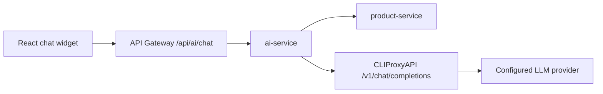

# HyperMall AI Chat MVP Plan

## Overview

Implement the smallest viable shopper-facing AI assistant on top of the unfinished `backend/ai-service` stub, using CLIProxyAPI as a private upstream relay. The MVP should let shoppers ask catalog and navigation questions from the web storefront, receive one non-streaming assistant response, and optionally see quick actions plus a small set of suggested products.

This plan keeps the integration deliberately narrow:

- React talks only to HyperMall backend via `/api/ai/chat`
- `ai-service` talks to CLIProxyAPI via OpenAI-compatible `/v1/chat/completions`
- no direct browser access to CLIProxyAPI
- no DB schema changes
- no image search, no recommendations API, no streaming in MVP

## Requirements

### Functional

1. Add a shopper-visible AI chat launcher/widget to `frontend/hypermall-web`.
2. Support one backend endpoint: `POST /api/ai/chat`.
3. Allow guest and authenticated shoppers to use the assistant.
4. Support these MVP use cases only:
   - product discovery (`"find me a budget gaming mouse"`)
   - product-page Q&A using current page context
   - store navigation/help (`"how do I track an order?"`)
5. Return plain assistant text plus optional quick actions and up to 3 product suggestions.
6. Keep chat history client-managed and short-lived in browser storage for MVP.

### Non-Functional

1. Reuse existing Spring Boot + gateway + config-server patterns.
2. Use existing `ApiResponse<T>` contract shape.
3. Keep AI provider secrets backend-only.
4. Fail safely with user-friendly fallback messaging.
5. Avoid new platform dependencies unless they materially simplify implementation.

## Smallest Viable End-to-End Feature Set

Ship only this in phase 1:

- floating chat button in `MainLayout`
- modal or drawer chat panel
- single prompt input + message list
- one backend endpoint `POST /api/ai/chat`
- optional page context: current path, current product id/slug/name
- backend grounding from product-service for simple product suggestions
- fallback UI when AI is unavailable

Explicitly defer:

- streaming/SSE/websocket chat
- multi-device session persistence
- order/account-specific live lookups
- image search
- separate recommendations endpoint
- admin/seller AI features
- storing prompts/responses in MySQL

## Architecture

### Recommended Flow



### Why this fits HyperMall

- matches the repo's microservice architecture instead of bypassing it
- keeps CLIProxyAPI replaceable
- avoids leaking provider details into React
- reuses gateway auth/rate-limit behavior
- keeps the MVP stateless on the backend

### Backend Design

Use `backend/ai-service` as a thin orchestration service with 4 responsibilities:

1. validate/sanitize chat requests
2. assemble prompt context and short conversation history
3. optionally fetch product grounding data from `product-service`
4. call CLIProxyAPI and map the result into HyperMall response DTOs

Recommended internal components:

- `controller/ChatController.java`
- `service/ChatService.java`
- `service/PromptBuilderService.java`
- `service/ProductGroundingService.java`
- `client/CliProxyApiClient.java`
- `config/AiProperties.java`
- `config/WebClientConfig.java`
- `config/SecurityConfig.java`

Do not add Redis persistence in MVP even though the stub has Redis dependency. Keep chat state in the frontend for now.

### Frontend Design

Add a sitewide AI widget rendered from `MainLayout` and controlled locally via a small hook/service, not Redux. Redux is unnecessary for this MVP because chat state is local to the widget.

Recommended pieces:

- `components/features/ai/AiChatWidget.tsx`
- `components/features/ai/AiChatLauncher.tsx`
- `components/features/ai/AiMessageList.tsx`
- `components/features/ai/AiSuggestedProducts.tsx`
- `hooks/useAiChat.ts`
- `services/ai.service.ts`
- `types/ai.types.ts`

Persist only `sessionId` and the last ~6 turns in `localStorage`.

## API Contracts

### `POST /api/ai/chat`

Request body:

```json
{
  "message": "Find me a wireless mouse under 500k",
  "sessionId": "8d5f1f6c-7f52-4ec3-9a0c-8c0c0d7e1234",
  "history": [
    { "role": "user", "content": "I need office accessories" },
    { "role": "assistant", "content": "What budget are you targeting?" }
  ],
  "context": {
    "pageType": "product-list",
    "path": "/search?q=mouse",
    "productId": null,
    "productName": null
  }
}
```

Response body inside `ApiResponse<ChatResponse>`:

```json
{
  "success": true,
  "message": "Success",
  "data": {
    "message": "Here are a few wireless mouse options under your budget.",
    "sessionId": "8d5f1f6c-7f52-4ec3-9a0c-8c0c0d7e1234",
    "suggestedActions": [
      { "type": "search", "label": "Wireless mouse", "value": "wireless mouse" },
      { "type": "link", "label": "View all mice", "value": "/search?q=mouse" }
    ],
    "productSuggestions": [
      {
        "productId": 101,
        "productName": "Logi Silent Mouse",
        "thumbnail": "https://...",
        "price": 399000.0
      }
    ],
    "degraded": false
  },
  "timestamp": "2026-03-19T12:00:00"
}
```

### DTO Recommendation

Keep the existing `ChatRequest` and `ChatResponse` files, but extend them minimally:

- `ChatRequest`
  - keep `message`, `sessionId`, `history`
  - add `context` object
  - validate max history length server-side
- `ChatResponse`
  - keep `message`, `sessionId`, `suggestedActions`, `productSuggestions`
  - add `boolean degraded`

### Error Contract

Use standard error responses for hard failures:

- `400` invalid request / overlong message
- `429` rate limit exceeded
- `503` CLIProxyAPI or upstream provider unavailable

Frontend fallback behavior:

- if API call fails, append a local assistant message like: `AI assistant is temporarily unavailable. Try search or browse categories.`
- surface 2-3 quick fallback links (`/products`, `/search`, `/profile` for order help)

## CLIProxyAPI Integration

### Upstream Contract

Use only the OpenAI-compatible path in MVP:

- `POST {AI_PROVIDER_BASE_URL}/v1/chat/completions`

Request shape sent by `ai-service`:

```json
{
  "model": "${AI_PROVIDER_MODEL}",
  "messages": [
    { "role": "system", "content": "You are HyperMall shopping assistant..." },
    { "role": "user", "content": "..." }
  ],
  "temperature": 0.3,
  "stream": false
}
```

Implementation choice:

- use `WebClient`
- do not add OpenAI Java SDK
- map only the fields needed for MVP

## Prompt and Grounding Strategy

### System Prompt Rules

The backend system prompt should enforce:

- answer only shopping/navigation/help topics for HyperMall
- do not invent product prices, stock, or policies when data is missing
- prefer concise recommendations
- when unsure, say so and suggest a search/category action
- never ask for passwords, OTPs, card details, or secrets

### Grounding Inputs

For MVP, grounding should be simple and deterministic:

1. page context from frontend
2. current product details if `productId` is present
3. product search result snippets when the assistant detects shopping intent

`ProductGroundingService` should call existing product APIs using lightweight internal HTTP calls and pass only safe fields to the prompt:

- product id
- name
- category
- price / salePrice
- rating
- thumbnail
- short description

Avoid full catalog dumps and avoid passing user PII.

## Environment Variables and Config

### Backend config-server (`ai-service.yml`)

Add a new config file with these values:

- `AI_SERVICE_PORT=8092`
- `AI_CHAT_ENABLED=true`
- `AI_PROVIDER_BASE_URL=http://localhost:8317`
- `AI_PROVIDER_API_KEY=`
- `AI_PROVIDER_MODEL=`
- `AI_PROVIDER_TIMEOUT_MS=15000`
- `AI_CHAT_MAX_MESSAGE_CHARS=2000`
- `AI_CHAT_MAX_HISTORY_MESSAGES=6`
- `AI_CHAT_PRODUCT_SUGGESTION_LIMIT=3`

Suggested property layout:

```yaml
app:
  ai:
    enabled: ${AI_CHAT_ENABLED:true}
    provider:
      base-url: ${AI_PROVIDER_BASE_URL:http://localhost:8317}
      api-key: ${AI_PROVIDER_API_KEY:}
      model: ${AI_PROVIDER_MODEL:gpt-4o-mini}
      timeout-ms: ${AI_PROVIDER_TIMEOUT_MS:15000}
    chat:
      max-message-chars: ${AI_CHAT_MAX_MESSAGE_CHARS:2000}
      max-history-messages: ${AI_CHAT_MAX_HISTORY_MESSAGES:6}
      product-suggestion-limit: ${AI_CHAT_PRODUCT_SUGGESTION_LIMIT:3}
```

### Frontend env

Keep and use:

- `VITE_ENABLE_AI_CHAT=true`

Optional additions:

- `VITE_AI_CHAT_STORAGE_KEY=hypermall_ai_chat_v1`

### Docker / local infra

Add a CLIProxyAPI container and config mount to `infrastructure/docker/docker-compose.dev.yml` so backend services can call a predictable local upstream during development.

## Gateway and Security Changes

### API Gateway

1. Add `ai-service` route to `backend/api-gateway/src/main/java/com/hypermall/gateway/config/GatewayConfig.java`.
2. Route `/api/ai/**` to `lb://ai-service`.
3. Add a public override for `POST /api/ai/chat` in `AuthenticationFilter.java` so guests can use it.

### ai-service Security

Create `backend/ai-service/src/main/java/com/hypermall/ai/config/SecurityConfig.java`.

Recommended rules:

- `POST /api/ai/chat` -> `permitAll()`
- actuator/swagger -> authenticated, consistent with other services
- keep `JwtAuthenticationFilter` enabled so authenticated users are still resolved when they send a Bearer token

This preserves optional user context without making guest chat impossible.

## Implementation Steps

### Phase 1 - Wire the service into the platform

1. Add `ai-service` to `backend/pom.xml` modules.
2. Add `backend/config-server/src/main/resources/configurations/ai-service.yml`.
3. Add gateway route in `GatewayConfig.java`.
4. Add gateway public path override for `POST /api/ai/chat`.
5. Confirm service name is `ai-service` and port is `8092`.

Acceptance criteria:

- `mvn -pl ai-service -am test` resolves module correctly
- gateway can route `/api/ai/chat` to the service

### Phase 2 - Build backend MVP in `ai-service`

1. Create service config classes (`AiProperties`, `WebClientConfig`, `SecurityConfig`).
2. Implement `ChatController` with `POST /api/ai/chat`.
3. Extend existing DTOs for `context` and `degraded`.
4. Implement `CliProxyApiClient` with timeout/error mapping.
5. Implement `PromptBuilderService` for system prompt + grounded prompt assembly.
6. Implement `ProductGroundingService` for current product/search grounding.
7. Implement `ChatService` orchestration.
8. Return `ApiResponse.success(chatResponse)` on success.

Acceptance criteria:

- valid request returns assistant text from CLIProxyAPI
- upstream failure returns safe 503 or degraded response per design
- no secrets logged

### Phase 3 - Add frontend chat widget

1. Add AI types and service layer.
2. Add `useAiChat` hook with local state + localStorage history.
3. Add `AiChatWidget` to `MainLayout` behind `VITE_ENABLE_AI_CHAT`.
4. Capture minimal context from route/product page.
5. Render assistant text, loading state, quick actions, and product cards.
6. Add fallback UI when backend returns 503 or times out.

Acceptance criteria:

- shopper can open widget from any storefront page
- shopper can send a prompt and receive a response
- suggested product cards link to `/products/:id`

### Phase 4 - Harden and verify

1. Add backend unit/integration tests.
2. Add frontend component/hook tests.
3. Add local docker instructions for CLIProxyAPI.
4. Add basic observability/logging fields for request id, session id, user id if present.

Acceptance criteria:

- narrow tests pass
- local developer can run end-to-end with config-server + gateway + ai-service + CLIProxyAPI

## Files to Modify/Create/Delete

### Modify

- `backend/pom.xml`
- `backend/api-gateway/src/main/java/com/hypermall/gateway/config/GatewayConfig.java`
- `backend/api-gateway/src/main/java/com/hypermall/gateway/filter/AuthenticationFilter.java`
- `backend/ai-service/src/main/java/com/hypermall/ai/dto/request/ChatRequest.java`
- `backend/ai-service/src/main/java/com/hypermall/ai/dto/response/ChatResponse.java`
- `frontend/hypermall-web/src/config/api.config.ts`
- `frontend/hypermall-web/src/components/layout/MainLayout/index.tsx`
- `frontend/hypermall-web/.env.example`
- `infrastructure/docker/docker-compose.dev.yml`

### Create

- `backend/config-server/src/main/resources/configurations/ai-service.yml`
- `backend/ai-service/src/main/java/com/hypermall/ai/config/AiProperties.java`
- `backend/ai-service/src/main/java/com/hypermall/ai/config/WebClientConfig.java`
- `backend/ai-service/src/main/java/com/hypermall/ai/config/SecurityConfig.java`
- `backend/ai-service/src/main/java/com/hypermall/ai/controller/ChatController.java`
- `backend/ai-service/src/main/java/com/hypermall/ai/service/ChatService.java`
- `backend/ai-service/src/main/java/com/hypermall/ai/service/PromptBuilderService.java`
- `backend/ai-service/src/main/java/com/hypermall/ai/service/ProductGroundingService.java`
- `backend/ai-service/src/main/java/com/hypermall/ai/client/CliProxyApiClient.java`
- `backend/ai-service/src/main/java/com/hypermall/ai/dto/internal/CliProxyChatCompletionRequest.java`
- `backend/ai-service/src/main/java/com/hypermall/ai/dto/internal/CliProxyChatCompletionResponse.java`
- `backend/ai-service/src/test/java/com/hypermall/ai/service/ChatServiceTest.java`
- `backend/ai-service/src/test/java/com/hypermall/ai/controller/ChatControllerTest.java`
- `frontend/hypermall-web/src/types/ai.types.ts`
- `frontend/hypermall-web/src/services/ai.service.ts`
- `frontend/hypermall-web/src/hooks/useAiChat.ts`
- `frontend/hypermall-web/src/components/features/ai/AiChatWidget.tsx`
- `frontend/hypermall-web/src/components/features/ai/AiChatLauncher.tsx`
- `frontend/hypermall-web/src/components/features/ai/AiMessageList.tsx`
- `frontend/hypermall-web/src/components/features/ai/AiSuggestedProducts.tsx`
- `frontend/hypermall-web/src/components/features/ai/AiChatWidget.test.tsx`

### Delete

- none for MVP

## Testing Strategy

### Backend

- unit test prompt assembly and response mapping
- controller test for validation, 200 success, 400 invalid, 503 upstream failure
- client test with mocked CLIProxyAPI responses

Suggested commands:

- `mvn -pl ai-service -am test -Dtest=ChatServiceTest`
- `mvn -pl ai-service -am test`

### Frontend

- widget render/open-close behavior
- successful send flow with mocked service
- fallback message on rejected promise
- product suggestion click navigation

Suggested commands:

- `npx vitest run src/components/features/ai/AiChatWidget.test.tsx`

### Manual verification

1. Start infra + CLIProxyAPI.
2. Run `service-registry`, `config-server`, `api-gateway`, `product-service`, `ai-service`, frontend.
3. Open storefront and ask:
   - `Find me cheap wireless earbuds`
   - `What does this product do?` from a product page
   - `How do I track my order?`

## Security Considerations

- never expose CLIProxyAPI URL or API key to the frontend
- keep CLIProxyAPI on private/local network only
- do not enable remote management API for CLIProxyAPI in MVP
- redact Authorization headers and upstream payload secrets from logs
- enforce max message length and max history length
- keep prompts free of payment, password, OTP, and address details unless a later phase explicitly needs that data
- sanitize route/page context before prompt inclusion

## Performance Considerations

- keep non-streaming responses for MVP
- set upstream timeout to ~15s max
- cap history to last 6 turns
- cap product suggestions to 3
- fetch product grounding only when needed, not on every request blindly
- keep prompt context compact to control latency and token cost

## Risks & Mitigations

- `Gateway route added but ai-service not public for guests` -> make `/api/ai/chat` public in both gateway filter behavior and ai-service security config
- `AI answers hallucinate catalog data` -> ground with product-service snippets and strict prompt rules
- `High latency or provider outage` -> frontend fallback message + backend timeout + 503 mapping
- `Scope creep into order support and personalized concierge` -> explicitly defer account/order live data to post-MVP
- `CLIProxyAPI operational complexity` -> use only OpenAI-compatible endpoint, one model, one API key in MVP

## TODO Tasks

- [ ] Wire `ai-service` into `backend/pom.xml`
- [ ] Add `ai-service.yml` to config-server
- [ ] Add `/api/ai/**` gateway route
- [ ] Make `POST /api/ai/chat` guest-accessible
- [ ] Build `ai-service` chat endpoint and CLIProxyAPI client
- [ ] Add product grounding for current product/search use cases
- [ ] Add frontend AI types/service/hook/widget
- [ ] Gate widget behind `VITE_ENABLE_AI_CHAT`
- [ ] Add backend and frontend tests
- [ ] Document local CLIProxyAPI startup for developers

## Recommended Order of Execution

1. Phase 1 wiring
2. Phase 2 backend chat endpoint
3. Manual Postman/curl verification against CLIProxyAPI
4. Phase 3 frontend widget
5. Phase 4 tests and hardening

## Final Recommendation

Use `backend/ai-service` as the single HyperMall-owned integration boundary and keep CLIProxyAPI strictly internal. For this repo, the best MVP is a non-streaming, stateless storefront chat assistant focused on catalog discovery and basic site help. That gets a real shopper-facing feature live with minimal repo churn and without prematurely introducing persistence, agent workflows, or multi-endpoint AI surface area.
