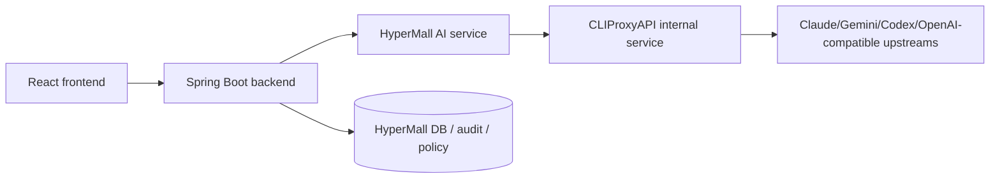

# Research Report: CLIProxyAPI Integration for HyperMall

Conducted: 2026-03-19

## Executive Summary

CLIProxyAPI is a Go-based AI gateway/proxy that exposes OpenAI-, Claude-, Gemini-, and Codex-compatible endpoints while sourcing credentials from local OAuth logins, API keys, or upstream OpenAI-compatible providers. Its main value is credential aggregation, model translation, multi-account routing, and protocol compatibility for CLI-oriented AI tooling. It is not a generic business API product; it is closer to an operator-managed AI relay layer.

For HyperMall, CLIProxyAPI should be treated as a backend-only infrastructure component, not something a React app talks to directly. The strongest fit is: Spring Boot owns all business workflows, policy, tenant/user authorization, logging, and rate limiting; CLIProxyAPI sits behind it as an internal AI transport gateway. React calls Spring Boot only. Spring Boot calls CLIProxyAPI over a private network using a single internal proxy API key.

Bottom line: use CLIProxyAPI only if HyperMall specifically needs OAuth-backed model access, provider failover, or OpenAI/Claude/Gemini protocol bridging. If HyperMall only needs a standard LLM integration with stable server-side API keys, a direct Spring Boot integration with one vendor SDK is simpler and safer.

## Table of Contents

- Executive Summary
- Research Methodology
- Key Findings
- Exposed API Surface
- Security Model
- Fit for HyperMall
- Recommended Architecture
- Integration Plan
- Risks and Pitfalls
- Sources

## Research Methodology

- Sources consulted: 8 primary sources
- Material types: GitHub README, main server entrypoint, config example, SDK docs, Management API docs, Quick Start, Docker Compose docs, server deployment tutorial
- Recency: repository/docs accessed 2026-03-19; examples and docs content span roughly 2024-2026
- Key search terms: `CLIProxyAPI README`, `CLIProxyAPI management api`, `CLIProxyAPI config`, `CLIProxyAPI docker`, `CLIProxyAPI server routes`, `CLIProxyAPI auth`

## Key Findings

### 1. What It Is

CLIProxyAPI is an API compatibility gateway for AI clients. It exposes standard-looking endpoints and translates/reroutes requests to different upstreams and credential types.

Main capabilities:

- OpenAI-compatible endpoints such as `/v1/chat/completions`, `/v1/completions`, `/v1/models`, `/v1/responses`
- Claude-compatible endpoints such as `/v1/messages` and `/v1/messages/count_tokens`
- Gemini-compatible endpoints under `/v1beta/models/...`
- OAuth login flows for Gemini CLI, Claude, Codex, Qwen, iFlow, Antigravity, Kimi
- API-key-based upstreams for Gemini, Claude, Codex, Vertex, and generic OpenAI-compatible providers
- Multi-account routing and retry/failover
- Config hot reload and runtime management API

This is not a frontend SDK. It is an HTTP service you run locally, in Docker, or on a server.

### 2. How It Is Run

Supported run modes:

- Local desktop/service install on macOS/Linux/Windows
- Docker or Docker Compose deployment
- Build from source with `go build -o cli-proxy-api ./cmd/server`
- Embedded as a Go library via `sdk/cliproxy`

Operational model:

- Default config file: `config.yaml`
- Default auth storage: `~/.cli-proxy-api`
- Default port: `8317`
- Default host: empty string, meaning bind all interfaces
- Optional TLS termination inside the process
- Optional alternate storage backends: Postgres, Git-backed config store, object store

Authentication bootstrap is often interactive:

- Local mode: run login commands such as `--claude-login`, `--codex-login`, `--login`
- Remote/server mode: docs recommend SSH tunnel or browser callback handling because OAuth callbacks are localhost-oriented

### 3. Exposed API Surface

#### Primary proxy endpoints

- `GET /` - health-ish landing response listing main endpoints
- `GET /v1/models` - OpenAI-style model listing, or Claude-style list when `User-Agent` starts with `claude-cli`
- `POST /v1/chat/completions` - OpenAI-style chat completions
- `POST /v1/completions` - OpenAI-style completions
- `POST /v1/messages` - Claude-compatible messages
- `POST /v1/messages/count_tokens` - Claude token counting
- `GET /v1/responses` - OpenAI Responses websocket handler
- `POST /v1/responses` - OpenAI Responses API
- `POST /v1/responses/compact` - compact responses variant
- `GET /v1beta/models` - Gemini model listing
- `GET /v1beta/models/*action` - Gemini model details
- `POST /v1beta/models/*action` - Gemini methods like `generateContent`, `streamGenerateContent`, `countTokens`
- `GET /v1/ws` - websocket route attachment point, optionally auth-protected

#### Management and auth endpoints

Management API is mounted at `/v0/management` only when a management secret exists.

Representative endpoints:

- `GET /v0/management/config`
- `PUT /v0/management/config.yaml`
- `GET/PUT/PATCH/DELETE /v0/management/api-keys`
- `GET/PUT/PATCH/DELETE /v0/management/gemini-api-key`
- `GET/PUT/PATCH/DELETE /v0/management/claude-api-key`
- `GET/PUT/PATCH/DELETE /v0/management/codex-api-key`
- `GET/PUT/PATCH/DELETE /v0/management/openai-compatibility`
- `GET /v0/management/auth-files`
- `POST /v0/management/auth-files`
- `GET /v0/management/*-auth-url` for starting OAuth login flows
- `POST /v0/management/oauth-callback`
- `GET /v0/management/usage`
- `GET /v0/management/logs`

Protocol notes:

- HTTP JSON for most APIs
- SSE/streaming support for streaming model responses
- websocket support for responses/ws flows and generic `/v1/ws`
- hot-reloaded YAML configuration

### 4. Authentication and Security Model

#### Client access to proxy endpoints

Proxy API authentication accepts several credential locations, depending on protocol:

- `Authorization: Bearer <api-key>`
- `X-Goog-Api-Key`
- `X-Api-Key`
- query params `key` or `auth_token`

Configured top-level `api-keys` act as the gateway's client-facing access control list.

#### Management API security

- All management requests require a management key, including localhost
- Accepted via `Authorization: Bearer <key>` or `X-Management-Key`
- Remote management is blocked unless `remote-management.allow-remote: true`
- Plaintext management secrets are bcrypt-hashed on startup and written back
- `MANAGEMENT_PASSWORD` creates an additional in-memory management secret
- Remote clients are temporarily banned after repeated auth failures
- If no management secret is configured, management routes return unavailable/404 behavior

#### Important security observations

- Default `host: ""` binds all interfaces; safe deployment requires explicit network controls
- Default management mode is localhost-only, but main proxy endpoints can still be remotely reachable if the port is exposed
- OAuth tokens and auth files are sensitive operational assets; they must stay server-side
- The project is built for operator-managed use, not zero-trust browser exposure

## Exposed API Surface vs HyperMall Needs

CLIProxyAPI gives HyperMall transport-level AI compatibility, but not product-level controls. Missing pieces HyperMall must still own in Spring Boot:

- end-user auth and RBAC
- tenant isolation
- business-level prompt policy and guardrails
- SKU/order/customer-specific authorization checks
- auditing tied to HyperMall user identity
- rate limiting and abuse controls by user/store/admin role
- redaction of PII/order/payment data before sending prompts upstream
- stable API contract for React

## Is It Meant To Be Local Proxy or Server-Side Service?

Answer: both, but its design center is local/operator-managed proxy first.

Evidence:

- Docs heavily emphasize local install, desktop GUI, OAuth login commands, localhost callbacks, and SSH tunnels for remote OAuth
- Management endpoints default to localhost-only remote-disabled posture
- Many supported projects are desktop trays, local dashboards, and personal routing tools
- It also supports Docker/VPS/cloud deployment, so server-side use is supported, but it requires more deliberate hardening

Practical interpretation for HyperMall:

- Do not embed it into the browser
- Do not let React call it directly
- Use it only as an internal service behind Spring Boot
- Prefer server-side deployment only if HyperMall needs its credential-routing and protocol-bridging strengths

## Recommended Architecture

### Recommended target architecture



### Why this is the best fit

- React never sees CLIProxyAPI secrets, routes, or provider quirks
- Spring Boot provides a stable HyperMall-owned API like `/api/ai/*`
- CLIProxyAPI stays replaceable; Spring Boot depends on an internal abstraction, not raw vendor formats
- AI provider switching remains an infra concern, not a frontend concern
- Audit, billing, and authorization stay inside HyperMall

### Recommended deployment pattern

- Run CLIProxyAPI as a separate internal container/service in the backend network
- Bind it to a private interface or internal Docker network only
- Configure one internal proxy API key for Spring Boot-to-CLIProxyAPI traffic
- Keep Management API disabled for remote access in production unless there is a strong operational reason
- If management must be enabled, front it with VPN/IP allowlist/reverse proxy auth and rotate the secret

## Integration Plan

### Backend integration

Create a dedicated Spring Boot adapter service, for example `AiGatewayClient`, that:

- calls CLIProxyAPI over internal HTTP
- sends `Authorization: Bearer <internal-proxy-key>`
- maps HyperMall requests to one internal request DTO, not vendor-specific payloads
- chooses endpoint based on use case:
  - OpenAI-style: `/v1/chat/completions` for most app features
  - Claude-style: `/v1/messages` only if a Claude-native payload is needed
  - Gemini-style: `/v1beta/models/...:generateContent` only if Gemini-native features matter
- applies timeouts, retries, circuit breaking, and structured error mapping
- logs HyperMall request IDs, user IDs, and sanitized prompt metadata

Recommended default: use only the OpenAI-compatible surface from Spring Boot unless a feature forces otherwise. It minimizes backend branching.

### Frontend integration

React should call Spring Boot endpoints such as:

- `POST /api/ai/chat`
- `POST /api/ai/summarize-order`
- `POST /api/ai/catalog-enrichment`

React should never:

- call CLIProxyAPI directly
- store proxy API keys
- consume management endpoints
- depend on provider-specific schemas

### Configuration approach for HyperMall

- Keep `remote-management.allow-remote: false`
- Set explicit `host` to internal/private bind target, not wildcard on an internet-facing host
- Set top-level `api-keys` to a strong internal secret used only by Spring Boot
- Prefer file or Postgres/object-store-backed auth management depending on ops maturity
- Separate prod vs non-prod credentials and configs

## Quick Start for a HyperMall POC

1. Run CLIProxyAPI in Docker on the backend network only.
2. Configure `api-keys` with one strong internal key.
3. Complete provider login/OAuth on the ops box, not from user browsers.
4. In Spring Boot, add a dedicated `WebClient`/`RestClient` wrapper for `/v1/chat/completions`.
5. Expose one narrow HyperMall endpoint, e.g. `POST /api/ai/chat`.
6. Add request/response sanitization and audit logging before production rollout.

Example backend call shape:

```http
POST /v1/chat/completions
Authorization: Bearer <internal-proxy-key>
Content-Type: application/json

{
  "model": "gpt-5",
  "messages": [
    {"role": "system", "content": "You are HyperMall assistant."},
    {"role": "user", "content": "Summarize this order issue..."}
  ],
  "stream": false
}
```

## Risks and Pitfalls

- Overexposing the service by leaving `host` wide open on a public server
- Treating CLIProxyAPI as a frontend-facing API gateway
- Letting business logic leak into provider-specific prompt formats
- Using Management API remotely without extra network-layer controls
- Building directly on Claude/Gemini-specific routes when OpenAI-compatible routes would suffice
- Forgetting that OAuth/account auth files are highly sensitive operational credentials

## Recommendation for HyperMall

Use CLIProxyAPI only as a private AI relay behind Spring Boot.

Recommended decision:

- `Use` if HyperMall needs multi-provider failover, OAuth-backed Claude/Codex/Gemini access, or frequent provider swapping
- `Do not use` if HyperMall only needs one or two standard API-key-based model vendors and values lower operational complexity

My recommendation for HyperMall is a limited adoption:

- start with a backend-only POC using OpenAI-compatible `/v1/chat/completions`
- keep CLIProxyAPI isolated on the internal network
- do not expose Management API publicly
- keep React fully decoupled from CLIProxyAPI

## Next Steps

1. Decide whether HyperMall actually needs CLIProxyAPI's multi-provider/OAuth features or whether direct vendor SDK integration is simpler.
2. If yes, stand up an internal-only Docker POC and verify one Spring Boot adapter against `/v1/chat/completions`.
3. Add security controls before broader rollout: private networking, secret management, audit logging, prompt redaction, and rate limiting.
4. Only after the backend contract is stable, build React UI on top of HyperMall-owned `/api/ai/*` endpoints.

## Sources

- GitHub README: https://github.com/router-for-me/CLIProxyAPI
- Quick Start: https://help.router-for.me/introduction/quick-start.html
- What is CLIProxyAPI?: https://help.router-for.me/introduction/what-is-cliproxyapi.html
- Management API: https://help.router-for.me/management/api
- Docker Compose docs: https://help.router-for.me/docker/docker-compose.html
- Docker server deployment tutorial: https://help.router-for.me/hands-on/tutorial-5.html
- Config example: https://raw.githubusercontent.com/router-for-me/CLIProxyAPI/main/config.example.yaml
- SDK usage: https://raw.githubusercontent.com/router-for-me/CLIProxyAPI/main/docs/sdk-usage.md
- Server entrypoint: https://raw.githubusercontent.com/router-for-me/CLIProxyAPI/main/cmd/server/main.go

## Unresolved Questions

- Whether HyperMall needs provider-native features that justify using Claude/Gemini-specific endpoints instead of standardizing on OpenAI-compatible requests
- Whether HyperMall operations prefers file-backed auth storage or a centralized Postgres/object-store model for production
